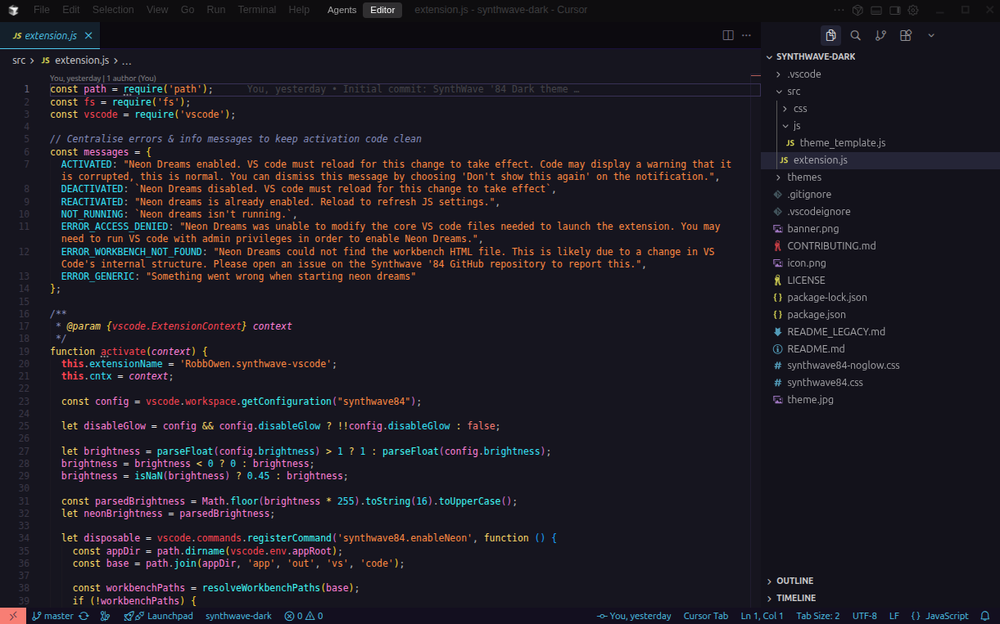

# SynthWave '84 Dark

A darker, higher contrast variant of [SynthWave '84](https://github.com/robb0wen/synthwave-vscode) with refined colors and improved readability.



## Changes from Original

- **Darker backgrounds** - Pure black activity bar, darker editor and sidebar
- **Higher contrast** - Improved text visibility and syntax highlighting
- **Refined UI colors** - Adjusted tabs, status bar, and panel colors
- **Custom syntax colors** - Tweaked token colors for better code readability

## Installation

### From Marketplace

Search for "SynthWave '84 Dark" in VS Code/Cursor extensions.

### Manual Installation

```bash
git clone https://github.com/z-bones/synthwave-dark.git ~/.vscode/extensions/z-bones.synthwave-dark
```

Then reload your editor and select "SynthWave '84 Dark" from the color theme picker.

## Neon Dreams (Optional Glow Effect)

This theme includes the optional neon glow effect from the original SynthWave '84.

**Note:** The glow effect modifies VS Code's internal files. Use at your own risk.

### Enable Glow
1. Open Command Palette (`Ctrl+Shift+P` / `Cmd+Shift+P`)
2. Run "SynthWave '84 Dark: Enable Neon Dreams"
3. Restart your editor

### Disable Glow
1. Open Command Palette
2. Run "SynthWave '84 Dark: Disable Neon Dreams"

### Customization

In your `settings.json`:

```json
// Adjust glow brightness (0.0 to 1.0, default: 0.45)
"synthwave84.brightness": 0.45,

// Disable glow but keep chrome updates
"synthwave84.disableGlow": true
```

### Fix Corruption Warning

After enabling glow, VS Code may show an "unsupported" warning. Install [Fix VSCode Checksums](https://marketplace.visualstudio.com/items?itemName=lehni.vscode-fix-checksums) and run "Fix Checksums: Apply" to remove it.

## Credits

Based on [SynthWave '84](https://github.com/robb0wen/synthwave-vscode) by [Robb Owen](https://github.com/robb0wen).

## License

MIT
